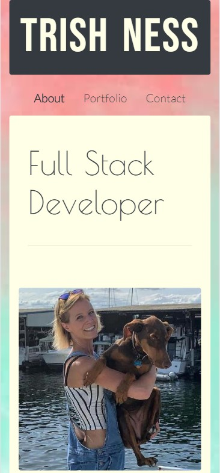

This project combines the elements of HTML and CSS that we have learned thus far in the bootcamp. It further incorporates the use of Bootstrap, a tool that quickly styles pages with a general template. This is the second version of this portfolio. For this version, I included additional features from Bootstrap that were a bit more advanced than I was previously comfortable with. The portfolio page has been updated with actual projects that I've worked on, and was changed to be displayed with a carousel feature. I left another version of the portfolio page attached in my files, but it is not linked up to the deployed version. The carousel incorporates multiple screenshots as well as cover photos for each project. I do like the styling, however still like the original version with one static photo and a link to the deployed site so that may be implemented again later down the road. I was also able to fix several bugs from the original portfolio version. Additional styles were added to the body, as well as a few animated features. The footer has been updated to include links to my GitHub, linkedIn and resume. The site has been developed in a mobile first design. I am not altogether pleased with it's desktop version - it is fully functional, but I feel that the portfolio site becomes overwhelming. Overall, I am pleased with this version and feel that it is an upgrade from the previous version, however, feel that a complete revamp will happen in my own time in the near future.

Deployed Version: https://trishness.github.io/portfolio/

